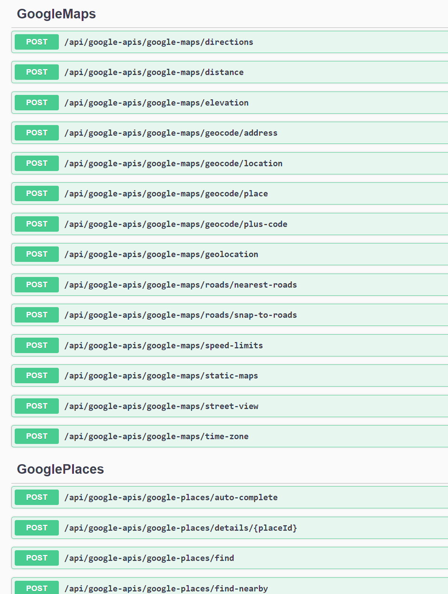

# ByteologyLLC.GoogleApiModule

## Introduction

Not long ago, I had the need to find a decent way to interface an application with Google's API for address verification and place details. Since I was building the core application using the fantastic [ABP Framework](https://abp.io/), I figured it would be beneficial to my future self and potentially others to package everything as an ABP module so it could be reused easily across any future ABP Framework projects.

The core API functionality leverages another fantastic open source library, [Michael Vivet's GoogleApi package](https://github.com/vivet/GoogleApi).

## Goals

The 2 main goals of this package are to make it easy for other developers to snap it into their ABP projects and utilize the Google APIs, and to make the code verbose and understandable. As such, much of the base library's classes and comments were duplicated and pulled up (for transparency and ease of use), and all of the controllers are defined explicitly rather than leveraging ABP's dynamic API controller system. This gives the developer full control over how the controllers behave, should their use-cases differ than my own.

## Projects

The solution contains the following projects:

- [Byteology.GoogleApiModule.Application.Contracts](src/Byteology.GoogleApiModule.Application.Contracts/readme.md) : Houses the data transfer objects, permissions, and interfaces that define the application services.
- [Byteology.GoogleApiModule.Application](src/Byteology.GoogleApiModule.Application/readme.md) : Houses the code for the application services.
- [Byteology.GoogleApiModule.Blazor.Server](src/Byteology.GoogleApiModule.Blazor.Server/readme.md) : **Currently Unused.**
- [Byteology.GoogleApiModule.Blazor.WebAssembly](src/Byteology.GoogleApiModule.Blazor.WebAssembly/readme.md) :  **Currently Unused.** Future home of widgets and UI elements for Blazor WASM projects.
- [Byteology.GoogleApiModule.Blazor](src/Byteology.GoogleApiModule.Blazor/readme.md) : **Currently Unused.** Future home of widgets and UI elements for Blazor server projects.
- [Byteology.GoogleApiModule.Domain.Shared](src/Byteology.GoogleApiModule.Domain.Shared/readme.md) : Houses enums, the options class, and localization information.
- [Byteology.GoogleApiModule.Domain](src/Byteology.GoogleApiModule.Domain/readme.md) : Core Domain project. Nothing really in here yet, but will house the caching entity information in a later version.
- [Byteology.GoogleApiModule.EntityFrameworkCore](src/Byteology.GoogleApiModule.EntityFrameworkCore/readme.md) : **Currently Unused.** Future home of EF core related repositories for caching results.
- [Byteology.GoogleApiModule.HttpApi.Client](src/Byteology.GoogleApiModule./readme.md) : **Currently Unused.** Not really planning on changing this past the defaults, but if you wanted to utilize this project inside a non-ABP application importing this would be the way to do it.
- [Byteology.GoogleApiModule.HttpApi](src/Byteology.GoogleApiModule.HttpApi/readme.md) : Houses the code for the controllers.
- [Byteology.GoogleApiModule.Installer](src/Byteology.GoogleApiModule.Installer/readme.md) : **Currently Unused.**
- [Byteology.GoogleApiModule.MongoDB](src/Byteology.GoogleApiModule.MongoDB/readme.md) : **Currently Unused.** Future home of MongoDb related repositories for caching results.
- [Byteology.GoogleApiModule.Web](src/Byteology.GoogleApiModule.Web/readme.md) : Houses widgets and a test page for MVC-based projects.

## Installing the project

### Nuget

If you just want to use the code as-is without customization, I am pushing the current versions to Nuget to make it easy to add to existing projects. If you would prefer to manually install the code and have complete control, skip this step and move onto the next.

Using the Package Manager Console, set the below application as the default project and run the associated command:

- Application : `Install-Package "ByteologyLLC.GoogleApiModule.Application"`
- Application.Contracts : `Install-Package "ByteologyLLC.GoogleApiModule.Application.Contracts"`
- HttpApi : `Install-Package "ByteologyLLC.GoogleApiModule.HttpApi"`

These are all that's required to get the API endpoints running. If you want to use the pre-built widgets you can also include the UI packages:

For MVC:

- Web : `Install-Package "ByteologyLLC.GoogleApiModule.Web"`

### Manually Installing the module

You can skip this if you installed via Nuget.

Create a directory in your main solution directory called `modules`, then create another directory under that called `Byteology.GoogleApiModule`.

Download the latest release from the [github](https://github.com/Byteology-LLC/Byteology.GoogleApiModule) and copy the content from the `src` folder into the `Byteology.GoogleApiModule` folder you created above.

At a bare minimum, you will need the following directories copied over:

- Byteology.GoogleApiModule.Application.Contracts
- Byteology.GoogleApiModule.Application
- Byteology.GoogleApiModule.HttpApi
- Byteology.GoogleApiModule.Web (currently the only UI with widgets, but in the future you can replace this with the other UI files)

Now, in each project in your main app whose name matches one of the names you just copied, open the `.csproj` file and add the following lines:

``` C#
<ItemGroup>
    <ProjectReference Include="..\modules\Byteology.GoogleApiModule\Byteology.GoogleApiModule.{PROJECT_NAME}\Byteology.GoogleApiModule.{PROJECT_NAME}.csproj" />
<ItemGroup>
```

### Add the DependsOn and Using statements

Then open the module file in that project and add the following using clause:

```C#
using Byteology.GoogleApiModule.{PROJECT_NAME}
```

and then add the following to the DependsOn attribute at the beginning of the class:

```C#
typeof(GoogleApiModule{PROJECT_NAME}Module)
```

Obviously replacing `{PROJECT_NAME}` with whatever project you happen to be in.

### Configure the Service

In your main application module, where you configure your services, add the following with whatever options you need inside your `ConfigureServices` method:

```C#
Configure<GoogleApiModuleOptions>(options =>
{
    //Required for everything.
    options.APIKey = configuration["GoogleApis:ApiKey"];

    //Required if you are calling the search endpoint
    //see https://programmablesearchengine.google.com/about/
    options.SearchEngineId = configuration["GoogleApis:SearchEngineId"];

    //Permissions System Options
    //Enables permissions for each method. Overrides RequireAuthentication. Defaults to false.
    options.RequireGranularPermissions = false;
    //Require authentication only. Useful to keep your API calls to authenticated users and keep usage low. Defaults to true.
    options.RequireAuthentication = true;

    //Premium endpoints. Basically you need an asset tracking license to use the speedlimits endpoint
    //in google maps, so this essentially bypasses the calls to that endpoint to avoid errors.
    //see: https://mapsplatform.google.com/solutions/enable-asset-tracking/
    //Defaults to false
    options.IncludePremiumEndpoints = false;

    //APIKey Overrides (optional). For when you have specific API keys for the specific endpoints. If you
    //have one of these set, it will override the value in ApiKey when the call is made to the associated endpoint.
    options.MapsApiKey = configuration["GoogleApis:MapsApiKey"];
    options.PlacesApiKey = configuration["GoogleApis:PlacesApiKey"];
    options.TranslateApiKey = configuration["GoogleApis:TranslateApiKey"];
    options.SearchApiKey = configuration["GoogleApis:SearchApiKey"];

    //ClientId (optional). Where applicable, identifies this application to the API via this value.
    options.ClientId = configuration["GoogleApis:ClientId"];

});
```

### Configure your appsettings.json file

The above options code assume you are using the `appsettings.secrets.json` files to store your ApiKey(s). If you are using a different mechanism, feel free to skip this part. Otherwise, add the following to your `appsettings.secrets.json` file, once again corresponding to whatever options you utilized in the service method:

```JSON
"GoogleApis": {
    "ApiKey": "your-api-key-here",
    "SearchEngineId":"your-search-engine-id-here",
    "MapsApiKey":"your-api-key-here",
    "PlacesApiKey":"your-api-key-here",
    "TranslateApiKey":"your-api-key-here",
    "SearchApiKey":"your-api-key-here",
    "ClientId":"your-client-id-here"
  }
```

That should be it. Now you can build and run your application, navigate to the `/swagger` endpoint and you should see the API endpoints documented:

